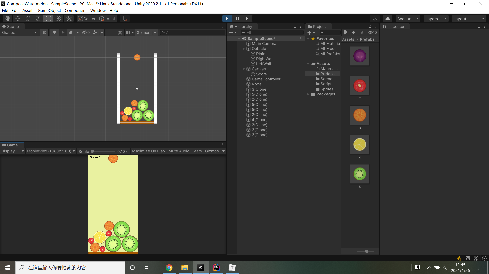

# CutWatermelon
这是一个unity 复刻“合成大西瓜”小游戏的项目



## 食用指南

将项目克隆到本地

```make
git clone git@github.com:centauruszzz/ComposeWatermelon
```

使用unity打开项目

* 主要资源位于Assets文件夹下，包括精灵图、脚本、预制件、舞台、材质（现在还没有）

## 改进方向

使用对象池，不再从本地加载

添加融合的动画和音效，使得视觉和听觉效果更加丝滑。

